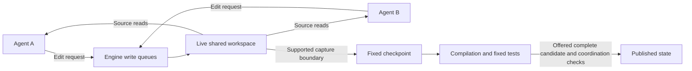

# Live shared-workspace coordination

Working design for [Specify live shared-workspace coordination and safe checkpoints](https://github.com/danielrispler/Falinks/issues/11). The developer selected the collaboration and editing policies below. The supported Codex runtime boundary is still being verified; this document does not claim a completed engine.

## Team and working code

A team implements one spec and its related subtasks concurrently in one live workspace. Subtasks assign responsibilities within the team. Unfinished changes are visible to ordinary source reads, and individual contributions need not compile independently. Per-agent branches and fixed private read views are not required.

Agents agree responsibilities, interface expectations and useful checkpoints ahead of time, then revise their plan through conversation. An editing announcement is advisory: it does not reserve a function while an agent reasons. Recipients choose whether to address a message immediately, continue other work or wait voluntarily for a relevant checkpoint. Waiting identifies a condition and has a bound; it does not impose an arbitrary completion deadline on a peer.

A file change affects subsequent reads; it does not rewrite an agent's existing context. Plans, actual edits, offered checkpoints and publication are distinct events. Notifications must identify what changed and reach the agent at supported interruption points. Deferring a message does not clear a stale declared dependency.

## Editing boundary

The first integration uses engine-mediated editing tools. Ordinary agent tools may read the live source, but direct source writes must be prevented. The controller accepts source mutations through its own tool path, associates them with a trusted client session and serializes conflicting check/write operations. Stale edits return their expected/current revision information for reconsideration; rejected edits preserve existing source and the proposed work.

Source-changing commands, formatters and generators must use controlled engine jobs. They cannot receive unrestricted controller privileges to write the live workspace. Their input, writable output area, completion boundary and application of resulting edits must be explicit. Unsupported or ambiguous capture fails safely; ordinary command completion is not proof that every writer has stopped.

The initial file/symbol queue granularity, revision representation and native-tool wiring still need verification. The coordination policy does not require automatic semantic conflict repair. [Attributable revisions and dependency history](https://github.com/danielrispler/Falinks/issues/12) owns the detailed history and dependency representation.

## Feedback and publication checkpoints

Agents may plan team test checkpoints and request earlier feedback. The first experiment tests whole-team snapshots; reconstructing only ready contributions is not required.

A feedback run captures exact workspace bytes, including unfinished work. Compilation failure can therefore be expected feedback. A passing feedback run alone does not authorize publication. Publication requires an explicitly offered complete checkpoint/group, the required compilation and fixed tests, and the coordination/dependency checks.

Capture must form one immutable candidate at a supported writer boundary. Agents may continue drafting after capture; later edits are outside that candidate. A failed check preserves live work and accepted state. Publication accepts exactly the checked candidate with its expected accepted base still current. Readiness messages and partnership do not bypass these gates.

[Publication authority and restart recovery](https://github.com/danielrispler/Falinks/issues/13) owns accepted-state authority, durable ordering, replay and recovery. The live workspace must not be confused with accepted state.

## Prior decisions being revised

Live shared reads reopen the fixed per-client read/explicit-adoption requirement in [the correctness decision](https://github.com/danielrispler/Falinks/issues/3) and [the earlier fixed-base proposal protocol](https://github.com/danielrispler/Falinks/issues/4). Their immutable captured-candidate, publication, work-preservation and explicit-dependency requirements remain in force. Historical research does not establish a performance advantage.

## Verification required

- Ordinary agent reads observe shared edits; agent context changes only through reads or delivered messages.
- Direct native, shell and descendant source mutations cannot bypass the selected boundary.
- Mediated edits validate paths, use trusted session attribution and reject stale preconditions without losing work.
- Controlled mutation jobs cannot write live source outside the queue or contribute ambiguously captured outputs.
- Checkpoint capture is coherent and immutable while subsequent drafting continues.
- Failed feedback runs do not publish; complete offered checkpoints use the existing publication gates.

Current primary references: [Codex permission profiles](https://learn.chatgpt.com/docs/permissions), [app-server client tools](https://learn.chatgpt.com/docs/app-server#dynamic-tool-calls-experimental). Installed-interface and scratch results must be reported separately from untested runtime behavior.
